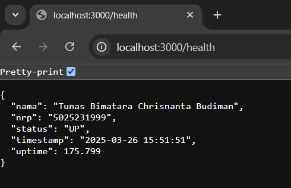
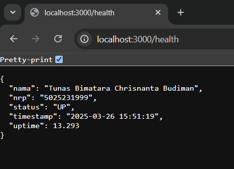
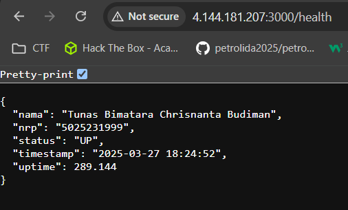
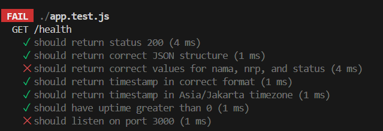
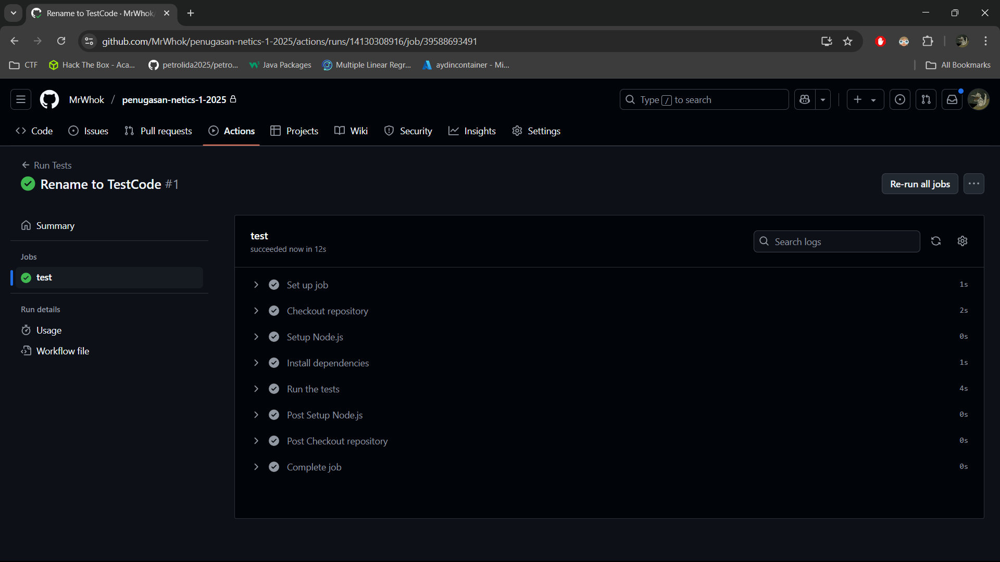
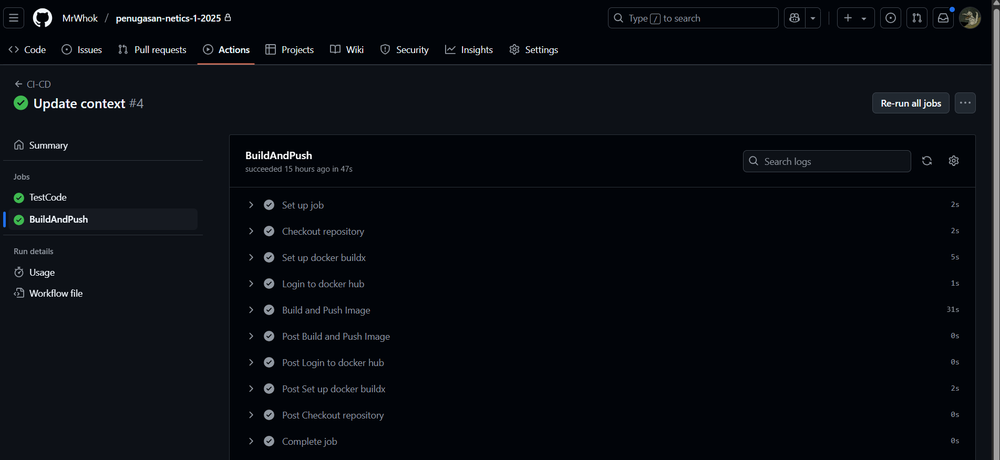
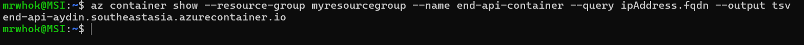
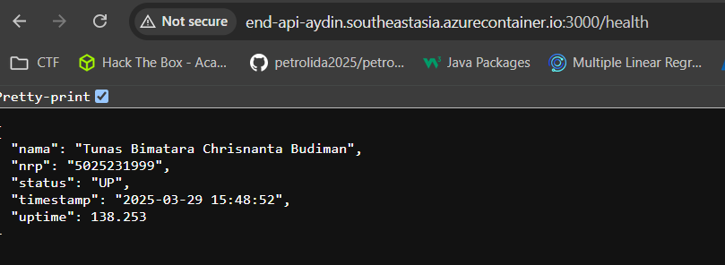

# penugasan-netics-1-2025

Pada repository ini berisi step-step pengerjaan dan dokumentasi untuk tugas 1 oprec netics.

## Pembuatan API endpoint

Dalam pembuatan API endpoint ini, saya menggunakan bahasa pemrograman yaitu javascript-express.

### STEP-STEP
1. Menginisialisasi projek baru dengan
    ```sh
    npm init -y
    ```
2. Menginstall dependensi yang dibutuhkan
    - express
    Berguna untuk memudahkan dalam pembuatan API.
    - nodemon
    Berguna untuk mengotomasi restart dari node.js saat terjadi perubahan kode.
    - moment-timezone
    Berguna untuk mendapatkan timestamp pada zona tertentu.
    ```sh
        npm install -g nodemon
        npm install express
        npm install moment
    ```
3. Mengupdate package.json
    ```js
    {
            "name": "express-api",
            "version": "1.0.0",
            "description": "",
            "main": "app.js",
            "scripts": {
            "start": "node app.js",
            "dev": "nodemon app.js"
        },
            "dependencies": {
            "express": "^4.17.1",
            "moment": "^2.29.1"
        },
            "devDependencies": {
            "nodemon": "^2.0.22"
        }
    }
    ```
4. Menulis kode API
```js
const express = require('express');
const app = express();
const moment = require('moment-timezone');
const startTime=Date.now();

app.get('/health', (req, res) => {
    const currentTime = moment().tz("Asia/Jakarta").format('YYYY-MM-DD HH:mm:ss');
    const uptime = (Date.now() - startTime) / 1000;
    res.json({
        nama: "Tunas Bimatara Chrisnanta Budiman",
        nrp: "5025231999",
        status: "UP",
        timestamp: currentTime,
        uptime: uptime
    });
});

app.listen(3000, () => {
    console.log('Server is running on port 3000');
});

```
5. Testing endpoint 
    - Jalankan kode
        ```sh
        npm run dev
        ```
    - Buka browser lalu masukan url
        ```
        http://localhost:3000/health
        ```
    - Hasil

    
        
    
    Dalam gambar diatas terlihat bahwa kode sudah berjalan dengan baik.

## Implementasi dengan Docker

Terdapat 2 stage pada implementasi Dockerfile nya, yaitu stage build dan stage runtime. Setelah menjadi docker image akan dipush ke docker hub.

### STEP-STEP
1. Stage build
```Dockerfile
FROM node:18 AS build

WORKDIR /app

COPY package*.json ./

RUN npm install --only=production

COPY . .
```

Dapat dilihat bahwa `COPY package*.json` dilakukan terpisah karena jika tidak terdapat perubahan package*.json maka `npm install` tidak akan dijalankan. Akan tetapi, jika kita melakukan `COPY . .` secara langsung dan terdapat perubahan file apapun maka akan merusak cache sehingga mengharuskan untuk `npm install` lagi. 

2. Stage runtime
```Dockerfile
FROM node:18-alpine As runtime

WORKDIR /app

COPY --from=build /app/node_modules ./node_modules

COPY --from=build /app .

EXPOSE 3000

CMD [ "node","app.js" ]
```

Pada stage tersebut akan meng copy hasil dari stage build ke stage runtime. Dapat dilihat bahwa `node_modules` di copy terlebih dahulu karena alasan caching seperti pada stage build.

3. Testing endpoint dengan docker 
    - Build menjaid docker image
        ```sh
        docker build -t end-api:latest .
        ```
    - Jalankan docker container
        ```sh
        docker run -p 3000:3000 end-api
        ```
    - Hasil
    

        
    
    Dalam gambar diatas terlihat bahwa kode sudah berjalan dengan baik.
4. Push ke docker hub
    - login
    ```sh
    docker login -u <your-username> -p <your-password>
    ```
    - push
    ```sh
        docker push aydin3008/end:api latest
    ```


## Deployment dengan Micorsoft Azur
### STEP-STEP
1. Membuat container registry
Mengisi semua yang diperlukan pada [link ini](https://portal.azure.com/?Microsoft_Azure_Education_correlationId=d3db8e9d-042b-41d5-8f02-71d38032b4b8&Microsoft_Azure_Education_newA4E=true&Microsoft_Azure_Education_asoSubGuid=39d178a7-04b4-4d5b-b743-02832f4f10ad#view/Microsoft_Azure_Marketplace/GalleryItemDetailsBladeNopdl/id/Microsoft.ContainerRegistry/selectionMode~/false/resourceGroupId//resourceGroupLocation//dontDiscardJourney~/false/selectedMenuId/home/launchingContext~/%7B%22galleryItemId%22%3A%22Microsoft.ContainerRegistry%22%2C%22source%22%3A%5B%22GalleryFeaturedMenuItemPart%22%2C%22VirtualizedTileDetails%22%5D%2C%22menuItemId%22%3A%22home%22%2C%22subMenuItemId%22%3A%22Search%20results%22%2C%22telemetryId%22%3A%221c984327-6cb3-435b-98b8-4728b60c05f4%22%7D/searchTelemetryId/79a766f5-00ac-4c2b-93f4-3b9b8f140dee)


2. Buat container instance
Mengisi pada link [ini](https://portal.azure.com/?Microsoft_Azure_Education_correlationId=d3db8e9d-042b-41d5-8f02-71d38032b4b8&Microsoft_Azure_Education_newA4E=true&Microsoft_Azure_Education_asoSubGuid=39d178a7-04b4-4d5b-b743-02832f4f10ad#view/Microsoft_Azure_Marketplace/GalleryItemDetailsBladeNopdl/id/Microsoft.ContainerInstances/selectionMode~/false/resourceGroupId//resourceGroupLocation//dontDiscardJourney~/false/selectedMenuId/home/launchingContext~/%7B%22galleryItemId%22%3A%22Microsoft.ContainerInstances%22%2C%22source%22%3A%5B%22GalleryFeaturedMenuItemPart%22%2C%22VirtualizedTileDetails%22%5D%2C%22menuItemId%22%3A%22home%22%2C%22subMenuItemId%22%3A%22Search%20results%22%2C%22telemetryId%22%3A%225ea4c72a-7822-4ddb-82b3-2f67711baec6%22%7D/searchTelemetryId/58eb99df-e507-4007-9477-3de6c5f84aa6)

3. Pilih image source Other registry
4. Masukan image yang sudah di push pada docker hub
5. Tambahkan port 3000 dengan protocol TCP
6. Hasil
    
    

    Dalam gambar tersebut terlihat bahwa telah sukses men deploy.


## Melakukan otomisasi dengan Github Action
Step implementasi dengan docker hingga deployment dengan Microsoft Azur dapat dilakukan secara otomatis dengan github actions. Selain itu juga dapat digunakan untuk mengecek apakah kode yang dibuat sudah sesuai atau tidak terlebih dahulu.
### STEP-STEP
#### Menambahkan job untuk cek dan test code
1. Install jest 
    - Jest
    Untuk melakukan test pada code.

    ```sh
    npm install --save-dev jest supertest
    ```
2. Buat jest.config.js
```js
module.exports = {
    testEnvironment: "node",
    roots: ["<rootDir>"],  
    collectCoverage: true,
    collectCoverageFrom: ["**/*.js"], 
};

```
3. Update package.json
    Update dan tambahkan syntax berikut pada package.json
    ```js
  "scripts": {
    "start": "node app.js",
    "dev": "nodemon app.js",
    "test": "jest --config jest.config.js"
  },
    ```
4. Buat app.test.js
    Buat file app.test.js untuk menambahkan testing pada code. 
    Test-test tersebut berupa:
        1. Memastikan mempunyai /health endpoint
        2. Response status code nya harus 200 yang menandakan sukses
        3. Struktur json nya harus benar, yaitu nama, nrp ,status, timestamp, uptime
        4. Value dari variabel nama, nrp, dan status harus sesuai
        5. Variabel timestamp harus mengikuti format yang YYYY-MM-DD HH:mm:ss
        6. Value dari variabel timestamp harus sesuai dengan zona asia/jakarta
        7. Value dari variabel uptime harus lebih dari 0
        8. Port nya harus 3000

5. Update app.js
Tambahkan code berikut di akhir baris,
```js
module.exports = app;
```

6. Testing pada local
- Ganti value port dan NRP
    
    

    Terlihat bahwa hasilnya sesuai karena menggagalkan 2 test.

7. Buat job untuk mengetest code

```yml
name: CI-CD

on:
  push:
    branches:
      - main
    paths:
      - 'src/**'
  pull_request:
    paths:
      - 'src/**'

jobs: 
  TestCode:
    runs-on: ubuntu-latest
  
    steps:
      - name: Checkout repository
        uses: actions/checkout@v4
    
      - name: Setup Node.js
        uses: actions/setup-node@v4
        with:
          node-version: 18
          cache: 'npm'

      - name: Install dependencies
        run: npm install
        working-directory: src
    
      - name: Run the tests
        run: npm test
        working-directory: src
```
Code diatas merupakan isi dari ci-cd.yml yang berguna untuk melakukan npm test ketika ada push yang mengarah ke main dan juga ketika ada pull request dan hanya akan berjalan jika yang berubah ada pada direktori src.

8. Testing pada Github Actions

    

    Terlihat bahwa job yang dibuat berjalan dengan baik.


### Menambahkan job untuk build dan push docker image
1. Tambahkan DOCKER_PASSWORD di github bagian secret
2. Buat job baru untuk push dan build
```yml
  BuildAndPush:
    runs-on: ubuntu-latest
    needs: TestCode
    steps:
      - name: Checkout repository
        uses: actions/checkout@v4

      - name: Set up docker buildx
        uses: docker/setup-buildx-action@v3
      
      - name: Login to docker hub
        uses: docker/login-action@v3
        with:
          username: ${{ secrets.DOCKER_USERNAME }}
          password: ${{ secrets.DOCKER_PASSWORD }}

      - name: Cache Docker layers
        uses: actions/cache@v3
        with:
          path: /tmp/.buildx-cache
          key: ${{ runner.os }}-buildx-${{ github.sha }}
          restore-keys: |
              ${{ runner.os }}-buildx-
        
      - name: Build and Push Image
        uses: docker/build-push-action@v5
        with:
          context: src
          file: src/Dockerfile
          push: true
          tags: ${{ secrets.DOCKER_USERNAME }}/end-api:latest
```
- Checkout repository 
    Melakukan checkout pada branch
- Set up docker buildx
    Melakukan pre build (agar lebih cepat dari docker build)
- Login to docker hub
    Melakukan login ke docker hub dengan username dan password. Password diambil dari secret
- Cache Docker layers
    Melakukan caching
- Build and Push Image
    Melakukan push ke docker-hub

3. Hasil


    


Pada gambar diatas terlihata bahwa job yang dibuat telah suskes. 

### Menambahkan job untuk deploy ke Microsoft Azure
1. Dapatkan credential untuk github action
```sh
az ad sp create-for-rbac --name "my-github-actions" --role contributor --scopes /subscriptions/<SUBSCRIPTION_ID> --sdk-auth
```
Output yang didapat berupa json. Simpan pada github actions dengan nama AZURE_CREDENTIALS

2. Tambahkan job baru untuk deploy ke Azure
```yml
  DeployToAzure:
    runs-on: ubuntu-latest
    needs: BuildAndPush
    steps:
      - name: Checkout repository
        uses: actions/checkout@v4
      
      - name: Login to Azure
        uses: azure/login@v1
        with:
          creds: ${{ secrets.AZURE_CREDENTIALS }}
      
      - name: Deploy to Azure Container Instance
        uses: azure/aci-deploy@v1
        with: 
          resource-group: myresourcegroup  
          dns-name-label: end-api-aydin  
          image: ${{ secrets.DOCKER_USERNAME }}/end-api:latest  
          registry-login-server: docker.io
          name: end-api-container
          location: Southeast Asia 
          ports: 3000
          cpu: 0.5
          memory: 1.5
```
- Checkout repository 
    Melakukan checkout pada branch
- Login to Azure
    Melakukan login pada microsoft azure dengan credentials
- Deploy to Azure Container Instance
    Melakukan deploy ke microsoft azure

3. Mendapatkan url
Dapat dilakukan dengan command
```sh
az container show --resource-group myResourceGroup --name end-api-container --query ipAddress.fqdn --output tsv
```
Output yang didapat seperti ini 




4. Hasil 




Hasil nya adalah sukses seperti pada gambar diatas.


## Kesimpulan

Untuk tahap yang dilakukan jika dengan manual adalah melakukan testing code, build dan push docker image, kemudian melakukan deploy di microsoft azure. Tentu hal ini akan memakan cukup waktu banyak jika dilakukan secara manual. Dengan adanya github actions ini, langkah-langkah tersebut dapat di otomisasi sehingga akan mempersingkat waktu menjadi jauh lebih cepat dan juga meminimalisasi error karena kesalahan penulisan.